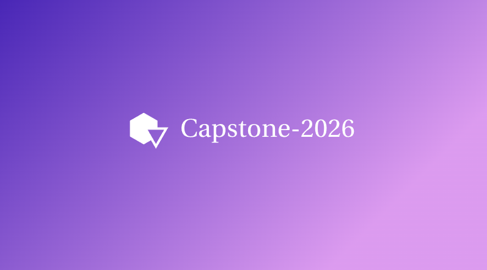
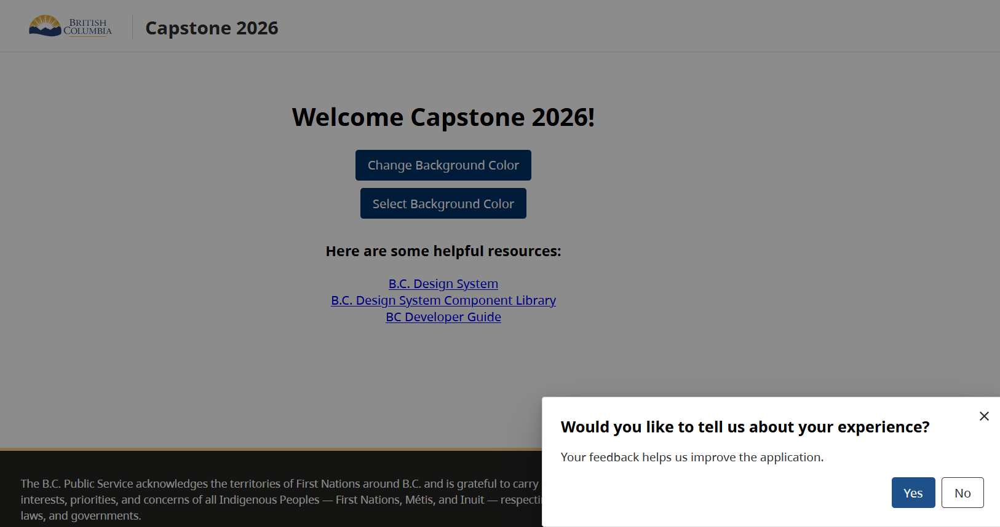
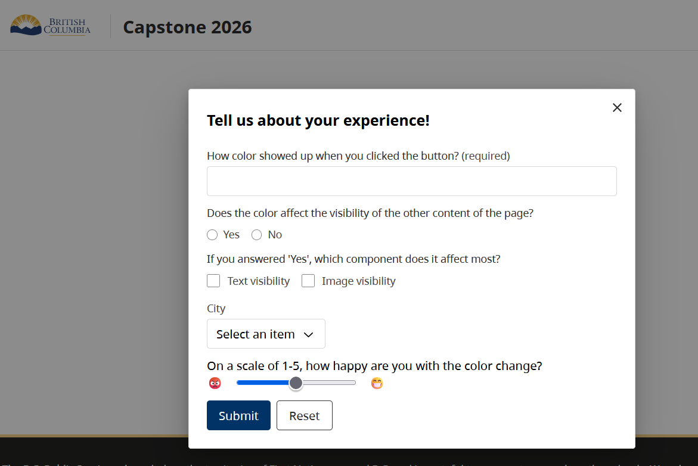
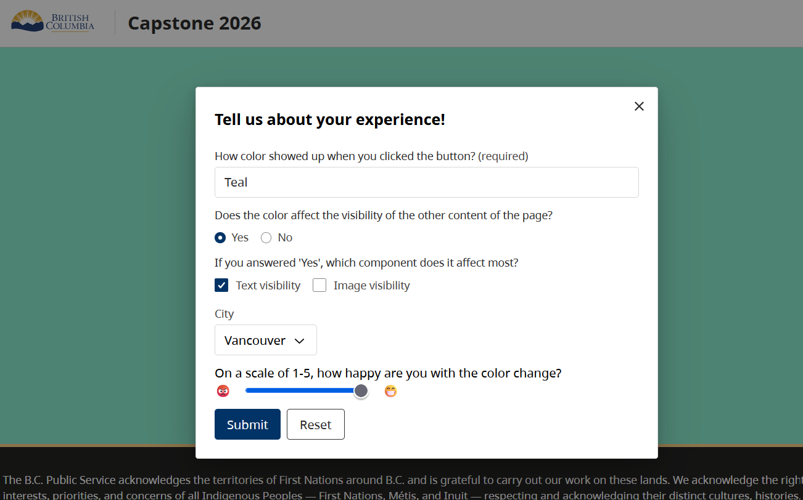
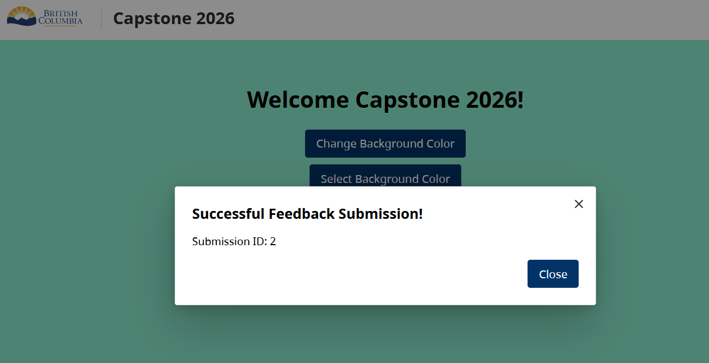

# 🚀 capstone-2026

<a id="readme-top"></a>
<!--
*** Read documentation carefully before launching application
-->


<!-- PROJECT SHIELDS -->
<!--
*** I'm using markdown "reference style" links for readability.
*** Reference links are enclosed in brackets [ ] instead of parentheses ( ).
*** See the bottom of this document for the declaration of the reference variables
*** for contributors-url, forks-url, etc. This is an optional, concise syntax you may use.
*** https://www.markdownguide.org/basic-syntax/#reference-style-links
-->
[![Contributors][contributors-shield]][contributors-url]
[![Forks][forks-shield]][forks-url]
[![Stargazers][stars-shield]][stars-url]
[![Issues][issues-shield]][issues-url]
[![project_license][license-shield]][license-url]
[![LinkedIn][linkedin-shield]][linkedin-url]


<!-- PROJECT LOGO -->
<br />
<div align="center">


<h3 align="center">Capstone-2026</h3>

  <p align="center">
    A feedback modal that is able to return meaningful results from aggregating data of BC Gov website users experiences.
    <br />
    <a href="https://github.com/bcgov/Capstone-2026"><strong>Explore the docs »</strong></a>
    <br />
    <br />
    <a href="https://github.com/bcgov/Capstone-2026">View Demo</a>
    &middot;
    <a href="https://github.com/bcgov/Capstone-2026/issues/new?labels=bug&template=bug-report---.md">Report Bug</a>
    &middot;
    <a href="https://github.com/bcgov/Capstone-2026/issues/new?labels=enhancement&template=feature-request---.md">Request Feature</a>
  </p>
</div>


<!-- TABLE OF CONTENTS -->
<details>
  <summary>Table of Contents</summary>
  <ol>
    <li>
      <a href="#about-the-project">About The Project</a>
      <ul>
        <li><a href="#built-with">Built With</a></li>
      </ul>
    </li>
    <li>
      <a href="#getting-started">Getting Started</a>
      <ul>
        <li><a href="#prerequisites">Prerequisites</a></li>
        <li><a href="#installation">Installation</a></li>
      </ul>
    </li>
    <li><a href="#usage">Usage</a></li>
    <li><a href="#roadmap">Roadmap</a></li>
    <li><a href="#contributing">Contributing</a></li>
    <li><a href="#license">License</a></li>
    <li><a href="#contact">Contact</a></li>
    <li><a href="#acknowledgments">Acknowledgments</a></li>
  </ol>
</details>


<!-- ABOUT THE PROJECT -->
## About The Project

Capstone 2026 project is a feedback modal that is resuable enough to be incorporated into many BC Government pages to recieve user feedback after completing a transaction. Our stretch goal included adding a dashboard feature for seeing compiled and meaningful data. 

 To avoid retyping too much info, do a search and replace with your text editor for the following: `bcgov`, `Capstone-2026`, `twitter_handle`, `linkedin_username`, `email_client`, `email`, `Capstone-2026`, `A feedback modal that is able to return meaningful results from aggregating data of BC Gov website users experiences.`, `project_license`

** Still need to fill in a few of these with the team 


<p align="right">(<a href="#readme-top">back to top</a>)</p>


### Built With

* [![React][React.js]][React-url]
* [![TypeScript][TypeScript]][TypeScript-url]
* [![Vite][Vite]][Vite-url]
* [![NestJS][NestJS]][NestJS-url]
* [![PostgreSQL][PostgreSQL]][PostgreSQL-url]
* [![PostGIS][PostGIS]][PostGIS-url]
* [![Docker][Docker]][Docker-url]
* [![Caddy][Caddy]][Caddy-url]

<p align="right">(<a href="#readme-top">back to top</a>)</p>


<!-- GETTING STARTED -->
## Getting Started

In the root folder copy .env.template and rename .env then add the database password to var DATABASE_URL.

Run docker compose up and Compose will start and run your entire app.
```
Docker compose up
```
In the backend folder, migrate the schema to be up to date with database 
```
npx prisma migrate reset 
for windows use - npx.cmd prisma migrate reset

### Prerequisites

How to install what you need 
* npm
  ```sh
  npm install npm@latest -g
  ```

### Installation

1. Get a free API Key at [https://example.com](https://example.com)
2. Clone the repo
   ```sh
   git clone https://github.com/bcgov/Capstone-2026.git
   ```
3. Install NPM packages
   ```sh
   npm install
   ```
4. Enter your API in `config.js`
   ```js
   const API_KEY = 'ENTER YOUR API';
   ```
5. Change git remote url to avoid accidental pushes to base project
   ```sh
   git remote set-url origin bcgov/Capstone-2026
   git remote -v # confirm the changes
   ```

<p align="right">(<a href="#readme-top">back to top</a>)</p>


<!-- USAGE EXAMPLES -->
## Usage

This project is intended to be an interactable modal that pops up when user completes a transaction on a BC gov website. The user should be able to engage or decline with the pop up 



When the feedback form opens the user is met with a variety of questions that are pulled from the database. Our project was built to be reusable and as such admins may change questions from our dashboard interface 



Once user fills in the form they are free to submit or cancel 



And a message should inform the user if their action was successful or not as well as give them an ID attatched to their form! 



**Add dashboard interface when completed

_For more examples, please refer to the [Documentation](https://code.visualstudio.com/docs/languages/markdown)


<p align="right">(<a href="#readme-top">back to top</a>)</p>


<!-- ROADMAP -->
## Roadmap

- [X] A button that opens a modal asking user to engage in feedback
- [X] A feedback form that opens and pulls questions from the database
- [X] A confirmation or error message depending on the success or failure of the feedback. 
- [] A dashboard for admin or product owners to modify questions or view aggregated data. 

See the [open issues](https://github.com/bcgov/Capstone-2026/issues) for a full list of proposed features (and known issues).

<p align="right">(<a href="#readme-top">back to top</a>)</p>


<!-- CONTRIBUTING -->
## Contributing

Contributions are what make the open source community such an amazing place to learn, inspire, and create. Any contributions you make are **greatly appreciated**.

If you have a suggestion that would make this better, please fork the repo and create a pull request. You can also simply open an issue with the tag "enhancement".
Don't forget to give the project a star! Thanks again!

1. Fork the Project
2. Create your Feature Branch (`git checkout -b feature/AmazingFeature`)
3. Commit your Changes (`git commit -m 'Add some AmazingFeature'`)
4. Push to the Branch (`git push origin feature/AmazingFeature`)
5. Open a Pull Request

<p align="right">(<a href="#readme-top">back to top</a>)</p>

### Top contributors:

<a href="https://github.com/bcgov/Capstone-2026/graphs/contributors">
  
</a>


<!-- LICENSE -->
## License

Distributed under the project_license. See `LICENSE.txt` for more information.

<p align="right">(<a href="#readme-top">back to top</a>)</p>


<!-- CONTACT -->
## Contact

Your Name - [@twitter_handle](https://twitter.com/twitter_handle) - email@email_client.com


Project Link: [https://github.com/bcgov/Capstone-2026](https://github.com/bcgov/Capstone-2026)

<p align="right">(<a href="#readme-top">back to top</a>)</p>


<!-- ACKNOWLEDGMENTS -->
## Acknowledgments

* []() Thank you to namecheap.com for the amazing free logo <a href> https://www.namecheap.com/
* []()
* []()

<p align="right">(<a href="#readme-top">back to top</a>)</p>


<!-- MARKDOWN LINKS & IMAGES -->
<!-- https://www.markdownguide.org/basic-syntax/#reference-style-links -->
[contributors-shield]: https://img.shields.io/github/contributors/bcgov/Capstone-2026.svg?style=for-the-badge
[contributors-url]: https://github.com/bcgov/Capstone-2026/graphs/contributors
[forks-shield]: https://img.shields.io/github/forks/bcgov/Capstone-2026.svg?style=for-the-badge
[forks-url]: https://github.com/bcgov/Capstone-2026/network/members
[stars-shield]: https://img.shields.io/github/stars/bcgov/Capstone-2026.svg?style=for-the-badge
[stars-url]: https://github.com/bcgov/Capstone-2026/stargazers
[issues-shield]: https://img.shields.io/github/issues/bcgov/Capstone-2026.svg?style=for-the-badge
[issues-url]: https://github.com/bcgov/Capstone-2026/issues
[license-shield]: https://img.shields.io/github/license/bcgov/Capstone-2026.svg?style=for-the-badge
[license-url]: https://github.com/bcgov/Capstone-2026/blob/master/LICENSE.txt
[linkedin-shield]: https://img.shields.io/badge/-LinkedIn-black.svg?style=for-the-badge&logo=linkedin&colorB=555
[linkedin-url]: https://linkedin.com/in/linkedin_username
[product-screenshot]: images/screenshot.png
<!-- Shields.io badges. You can a comprehensive list with many more badges at: https://github.com/inttter/md-badges -->
[Next.js]: https://img.shields.io/badge/next.js-000000?style=for-the-badge&logo=nextdotjs&logoColor=white
[Next-url]: https://nextjs.org/
[React.js]: https://img.shields.io/badge/React-20232A?style=for-the-badge&logo=react&logoColor=61DAFB
[React-url]: https://reactjs.org/
[Vue.js]: https://img.shields.io/badge/Vue.js-35495E?style=for-the-badge&logo=vuedotjs&logoColor=4FC08D
[Vue-url]: https://vuejs.org/
[Angular.io]: https://img.shields.io/badge/Angular-DD0031?style=for-the-badge&logo=angular&logoColor=white
[Angular-url]: https://angular.io/
[Svelte.dev]: https://img.shields.io/badge/Svelte-4A4A55?style=for-the-badge&logo=svelte&logoColor=FF3E00
[Svelte-url]: https://svelte.dev/
[Laravel.com]: https://img.shields.io/badge/Laravel-FF2D20?style=for-the-badge&logo=laravel&logoColor=white
[Laravel-url]: https://laravel.com
[Bootstrap.com]: https://img.shields.io/badge/Bootstrap-563D7C?style=for-the-badge&logo=bootstrap&logoColor=white
[Bootstrap-url]: https://getbootstrap.com
[JQuery.com]: https://img.shields.io/badge/jQuery-0769AD?style=for-the-badge&logo=jquery&logoColor=white
[JQuery-url]: https://jquery.com 

[React.js]: https://img.shields.io/badge/React-20232A?style=for-the-badge&logo=react&logoColor=61DAFB
[React-url]: https://react.dev/

[TypeScript]: https://img.shields.io/badge/TypeScript-3178C6?style=for-the-badge&logo=typescript&logoColor=white
[TypeScript-url]: https://www.typescriptlang.org/

[Vite]: https://img.shields.io/badge/Vite-646CFF?style=for-the-badge&logo=vite&logoColor=white
[Vite-url]: https://vitejs.dev/

[NestJS]: https://img.shields.io/badge/NestJS-E0234E?style=for-the-badge&logo=nestjs&logoColor=white
[NestJS-url]: https://nestjs.com/

[PostgreSQL]: https://img.shields.io/badge/PostgreSQL-316192?style=for-the-badge&logo=postgresql&logoColor=white
[PostgreSQL-url]: https://www.postgresql.org/

[PostGIS]: https://img.shields.io/badge/PostGIS-008000?style=for-the-badge
[PostGIS-url]: https://postgis.net/

[Docker]: https://img.shields.io/badge/Docker-2496ED?style=for-the-badge&logo=dockers&logoColor=white
[Docker-url]: https://www.docker.com/

[Caddy]: https://img.shields.io/badge/Caddy-1F88C0?style=for-the-badge&logo=caddy&logoColor=white
[Caddy-url]: https://caddyserver.com/